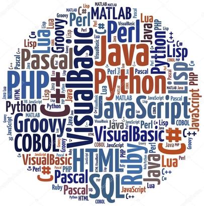
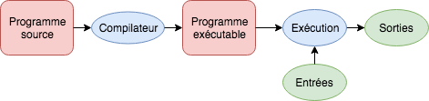
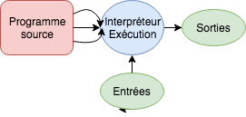
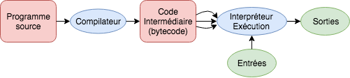

# Introduction à la programmation

Christophe Saint-Jean

[Transparents du cours](https://gitpitch.com/christophesaintjean/cours/IntroProgS1)

[Code du cours](https://tinyurl.com/y92hrbqf)

Année 2018-2019

---

@transition[fade]

## Organisation de l'UE

+++

### L'équipe enseignante

* **Christophe Saint-Jean** (Cours/TP - Resp.)
* El Hadi Zahzah (TP)
* Jordan Calandre (TP)
* Laurent Mascarilla (TP)
* Matthieu Robert (TP)
* Sanae Boutarfass (TP)

+++

### Communication

* Questions pédagogiques : [Moodle](https://moodle.univ-lr.fr/)
  * Appronfondissement/Questions (Forum)
  * Organisation de l'UE/Planning (Messages privés)
* Questions administratives (Secrétariat)
  * Appartenance groupes TD/TP
  * Absences/Justifications

+++

### Dispositif horaire

@ul

* 5 cours de 1,5 heures (Amphithéâtre)
* 10 TPs de 1,5 heures (Sallles de TP)
* 2 créneaux de 1,5h de TEA (Salles de TP)

@ulend

+++

### Evaluation

$$S_1 = (CC_1+CC_2)/2$$
$$S_2 = CC_3$$

Les CC se passent en TP (5/6 et 10) sur machine:

@ul

* Une partie QCM
* Une partie évaluée par un enseignant
* Attention à la règle sur les absences

@ulend

+++

### Les objectifs de cet enseignement

* Découvrir les bases de la programmation informatique
* Développer l'esprit logique par la pratique de la programmation
* Appprendre un des langages support de votre formation
* Libérer votre créativité !!

+++

### *Sondage !*



---

@transition[fade]

## Généralités sur la programmation

---

### Langage humain

@ul

* Un certain _vocabulaire_, _une orthographe_, des _règles de grammaire_ communes
* Grande expressivité et diversité
* Même si l'on commet des erreurs, nous sommes capables de comprendre "globalement" le message

@ulend

+++

### Langage informatique

@ul

* La machine traite des informations binaires: 100110010101000110 ... (même si images, sons, *programmes*, ...)
* Le vocabulaire d'instructions machine est très réduit
* Pas ou peu (encore) d'expressivité
* Pas de tolérance aux erreurs d'instructions

@ulend

---

### Niveau d'un langage

Différents niveaux d'abstraction par rapport aux instructions du processeur:

* 100110010101000110 ... (Quasi-impossible)
* Langages de bas niveau (Ex. Assembleur)
* Langages de bas/haut niveau (Ex. C)
* Langages de haut niveau (Ex. Python, Java, C++, R, ...)

+++

### Programme Source (ou Code)

Un programme source est un ___texte___ qui:

* Dépend d'un *langage de programmation*
* Utilise un certain nombre de _conventions_ (nommage, opérations, ...),
* Obéit à des règles de _syntaxe_, de _grammaire_.
* En géneral, sauvegardé puis exécuté depuis un fichier.

Le mode d'exécution du programme est variable (compilation, interprétation, hybride)

+++

### Les différentes sources d'erreur

@ul

* Erreurs de syntaxe: Non respect des conventions du langage
* Erreurs d'exécution (Runtime-Error): Opération non valide lors de l'exécution
* Erreurs sémantiques: Résultat différent de celui désiré

@ulend

---

### Exécution d'un programme (Compilation) 1/2



Compilation et exécution pour le compilateur gcc:

```bash
  > gcc source.c -o prog_executable.exe
  > ./prog_executable.exe
```

+++

### Exécution d'un programme (Compilation) 2/2


Analogie: Service de traduction intégrale à distance

Propriétés:

@ul

* Cible un type de machine (rapide)
* Vérification de la syntaxe à la compilation (Temps de compilation long)
  
@ulend

---

### Exécution d'un programme (Interprétation) 1/2



Exemple ligne de commande Unix (bash):

```bash
 > echo $((4+5))
 9
 > echo $nexistepas

 > [ -x  3]
 -bash: [: missing `]'
```

+++

### Exécution d'un programme (Interprétation) 2/2


Analogie: Traduction à la volée puis exécution

Propriétés:

@ul

* Flexible car pas de cible (c'est l'interpréteur)
* Cycle Vérification + Exécution (lent)
* Découverte d'erreurs à l'exécution

@ulend

---

### Exécution d'un programme (Hybride) 1/2



Compilation et interprétation d'un code Java:

```bash
 > javac HelloWorld.java
 > java HelloWorld
```

+++

### Exécution d'un programme (Hybride) 2/2


Le meilleur des deux mondes:

* Flexible
* Relativement rapide
* Multi-cible
* Supprime les erreurs de syntaxe à la compilation

---

### Mode d'exécution - Conclusion

* De nombreux langages disposent à la fois de compilateurs et d'interpréteurs.
* C'est l'usage historique qui a fait penché la balance...
* *Python* s'exécute en mode hybride même s'il pourrait croire qu'il s'agit d'un pur interpréteur:

```bash
 > python HelloWorld.py
```

[Arguments techniques - hors cadre de l'UE](http://autourducode.com/le-bytecode-python.html)

---

### Les outils d'édition du code 1/2

Un "bon" _environnement de développement intégré_ est un programme qui:

@ul

* Facilite l'édition du code (coloration syntaxique, saisie prédictive, ...)
* Intègre les règles de bonnes pratiques d'un langage (Ex.: PEP8 pour Python)
* Détecte les erreurs de syntaxe lors de l'édition

@ulend

+++

### Les outils d'édition du code 2/2

Un "bon" _environnement de développement intégré_ est un programme qui:

@ul

* Permet de compiler/d'interpreter un code source par un clic
* Donne accès à des outils de débogage (valeurs des variables, point d'arrêt, ...)
* Gestion de projets, des versions, lancement du code à distance, ...

@ulend

---

@transition[fade]

## Généralités sur les langages de programmation

---

### Quelques paradigmes

On peut catégoriser les langages suivants des propriétés qui les caractérisent:

* Langages impératifs
* Langages procéduraux
* Langages à objets
* Langages déclaratifs

[et bien d'autres ...](https://fr.wikipedia.org/wiki/Paradigme_programmation)

La plupart des langages sont multi-paradigmes.

+++

### Langage impératif 1/2

Un langage est dit impératif lorsque le programme correspond à une succession d'instructions:

```python
Instruction 1
Instruction 2
...
Instruction n
```

Chaque instruction tient compte de l'état du système (mémoire, E/S, ...) et peut le modifier.

+++

### Langage impératif 2/2

On y trouve le même genre d'instructions:

* Affectations d'une valeur à une _variable_
* Le saut conditionnel "If"
* Les répétitives "Pour" et "Tant que"
* Optionnel: le saut inconditionnel "Goto"

---

### Langage procédural

Il s'agit simplement de pouvoir regrouper un ensemble d'instructions nommé __procédure__ (ou *routine* ou *sous-routine*).

```python
Procédure Quelconque:
    Instruction 1
    Instruction 2
    ...
    Instruction n
```

On parle de __programme modulaire__ lorsque regroupe thématiquement des procédures dans un *module* (ou *bibliothèque* ou *paquet*)

---

### Langage orienté objet 1/2

Dans ce type de langage, les programmes sont organisés autour de briques logicielles appelées *Objets* qui:

* représente un concept, une entité réelle ou non
* possède une représentation interne (*attributs* ou *slots*)
* disposent de *méthodes* ou *slots*:
  * récupérer/changer sa répresentation interne
  * exécuter des traitements
  * interagir avec d'autres objets

+++

### Langage orienté objet 2/2

  ```java
 class Ballon {
    double rayon;  
    Ballon(double rayon) {
      this.rayon = rayon;
    }
    void gonfler() {
      this.rayon = this.rayon + 1;
    }
    void collision(Ballon autre){
      double rayon = (this.rayon + autre.rayon)/2;
      this.rayon = autre.rayon = rayon;
    }
  }
```

---

### Aparté : Langage déclaratif

On parle de *programmation déclarative* lorsqu'on décrit le résultat attendu, les objectifs (**quoi**) sans donner la manière de le faire (**comment**).

Exemple: page HTML5 minimaliste

```html
<!DOCTYPE html>
<html>
<head><title>This is Hello World page</title></head>
<body>
<h1>Hello World</h1>
</body>
</html>
```

---

@transition[fade]

## Généralités sur le langage Python

---

### Caractéristiques du langage

Créé en 1991, Python est un langage multi-paradigme:

* Impératif et procédural, orienté-objet
* Fourni avec un interpréteur (usage dominant) qui:
  * infère le type des variables lors de l'exécution (typage dynamique)
  * gère la mémoire automatiquement (ramasse-miettes)
* qui dispose d'une grande bibliothèque de base (modules)
* Version actuelle: **3.7.0** (ou *2.7.15*)

---

### Outils d'édition du code Python

* *Thonny* (cette UE)
* *Visual Code*
* *Spyder* (Calcul scientifique)
* NetBeans, *PyCharm*
* *Jupyter Notebook* (voir TEA)

[Liste complète](https://wiki.python.org/moin/IntegratedDevelopmentEnvironments)

---

### Exemple d'un programme Python

```Python
print('Hello World!!')
```

Test via Thonny:

* en mode interactif
* en mode script

_Par convention, les scripts Python ont pour extension **\*.py**_

---

@transition[fade]

## Les variables

---

### Variable (définition)

Une variable est une zone de la mémoire dans laquelle une valeur est stockée.

Elle est désignée par:

* un **nom** pour le programmeur
* une **adresse** pour l'ordinateur

La fonction *id* renvoie un nombre unique (~ adresse) qui qualifie une variable.

---

### Type d'une variable

Le **type** d'une variable définit les opérations valides pour elle.

Types élémentaires:

* Les nombres entiers
* Les nombres "réels" ou "à virgule"
* Les chaînes de caractères
* Les booléens

La fonction *type* renvoie le type d'une variable.

+++

### Déclaration d'un variable

En Python, la **déclaration** et l'**initialisation** d'une variable se fait de manière simultanée.

```python
In [1]: a = 2

In [2]: type(a)
Out[2]: int

In [3]: id(a)
Out[3]: 4525733248
```

---

#### Remarques sur le typage 1/2

* Le type d'une variable est donné par le type de l'expression à droite du = (*Inférence de type*)
* Toute variable a un type (*Typage fort*) (qui peut changer lors de l'éxécution (*Typage dynamique*)

+++

##### Remarques sur le typage 2/2

```python
In [1]: a = 2

In [2]: type(a)
Out[2]: int

In [3]: a = 3.14159

In [4]: type(a)
Out[4]: float

In [5]: type(3.14159)
Out[5]: float
```

---

## Les types de base de Python

---

### Les types numériques: *int*

* entier avec précision arbitraire
* attention, le type *long* existait dans les versions précédentes

```python
In [1]: type(2)
Out[1]: int

In [2]: 2**1024
Out[2]: 179769313486231590772930519078902473361797697894230657273430081157732675805500963132708477322407536021120113879871393357658789768814416622492847430639474124377767893424865485276302219601246094119453082952085005768838150682342462881473913110540827237163350510684586298239947245938479716304835356329624224137216
```

---

### Les types numériques: *float*

* nombre à virgule avec une précision **fixe**
  `$$[2.26.. * 10^{-308}, 1.79.. * 10^{308}]$$`

* Tous les nombres réels ne sont pas représentables par le type _float_

```python
In [1]: 1.79e308
Out[1]: 1.79e+308

In [2]: 1.79e308*10
Out[2]: inf

In [3]: type(1.79e308*10)
Out[3]: float

In [4]: 1e20 + 1
Out[4]: 1e+20
```

---

### Autres types numériques

Seront également évoqués si besoin en TP:

* *complex* : les nombres complexes
* *decimal* : les nombres décimaux
* *fraction* : les nombres rationnels
  
pour mémoire:
*float* $\subset$ *decimal* $\subset$ *fraction* $\subset$ $\mathbb{R}$

type *int* := $\mathbb{Z}$

---

### Opérations sur les types numériques

* Arithmétique usuelle: +, -, *, /
* Division entière: a // b (arrondi vers $-\infty$)
* Reste de la division entière: a % b
* Puissance: a ** b  ou  pow(a,b)
* Valeur absolue: abs(a)

---

### Le type booléen

* Il permet de représenter les valeurs de vérité *True* ou *False*
* Opérations sur les booléens (priorité décroissante):
  * *not*: négation logique
  * *and*: "et" logique
  * *or*:  "ou" logique

```python
In [1]: type(True)
Out[1]: bool

In [2]: True and not False
Out[2]: True
```

---

### Les chaines de caractères 1/2

Les chaînes de caractères sont délimitées par les simples ou doubles guillemets.

L'opération de **concaténation** de deux chaînes est effectuée par le symbole *+*.

+++

### Les chaines de caractères 2/2

```python
In [1]: a = 'abc'

In [2]: b = 'def'

In [3]: a + b
Out[3]: 'abcdef'
```

---

### Le type NoneType

* *None* est une valeur spéciale pour indiquer qu'une variable *existe* mais *n'a pas de contenu connu* (valeur manquante)
* Peut indiquer également "n'a pas de sens"

```python
In [1: a
...
NameError: name 'a' is not defined

In [2]: a = None

In [3]: a
```

---

### Conversion implicite entre types numériques

```python
In [1]: type(1+2.)
Out[1]: float

In [2]: 2**100000 + 5.
...
OverflowError: int too large to convert to float
```

**Ccl**: calcul mixte int/float -> float

---

### Conversion implicite entre types 1/2

Par **convention**, le *True* "équivaut" à 1 et *False* à 0 dans les calculs numériques.

```python
In [1]: True * 2
Out[1]: 2
```

+++

### Conversion implicite entre types 2/2

A l'opposé, *0* ou *None* sont considérées comme *False*, sinon *True* dans les expressions booléennes.

```python
In [1]: not 0
Out[1]: True
```

+++

### Conversion explicite entre types

On peut forcer la conversion avec la syntaxe:

```python
    <type>(<expression>)
```

Exemples:

```python
In [1]: int(4.7)
Out[1]: 4

In [2]: bool(0)
Out[2]: False

In [3]: str(4.7)
Out[3]: '4.7'
```

---

## Entrées-Sortie Clavier/Ecran

+++

### Affichage à l'écran

Syntaxe sur la fonction *print*:

```python
print(value, ..., sep=' ', end='\n', file=sys.stdout, flush=False)
```

* ... : *print* accepte une suite de valeurs converties en *str*
* sep: le séparateur
* end: le caractère de fin
* file : flux de sortie (sys.stdout est l'écran)
* flush : force à vider le flux immédiatement.

+++

#### Exemples d'affichage 1/2

```python
In [1]: année = 2018

In [2]: print(année)
2018

In [3: print("année", année)
année 2018
```

+++

#### Exemples d'affichage 2/2

```python
In [4]: print("l'année", année, end=""); print(" est un bon cru !!")
l'année  2018 est un bon cru !!

In [5]: print(année, année*2, année / 2, type(année), sep=", ")
2018, 4036, 1009.0, <class 'int'>
```

On remarque:

* Il n'a pas de "Out" (Output) pour *print*
* *Confusion usuelle*: l'affichage à l'écran n'est pas un retour de la fonction *print*.

+++

### Saisie Utilisateur

Fonction *input* :

```python
  input(prompt=None)
```

retourne la chaîne de caractères saisie.

```python
<<<<<<< HEAD
In [1]: a = int(input('Nombre de pas ? '))
=======
In [1]: a = int(input('Nombre de pas ? ))
>>>>>>> 6c4b49c879d32548b07161d13604d621b5062950
Nombre de pas ? 12

In [2]: b = float(input('pi ? '))
pi ? 3,14
...
ValueError: could not convert string to float: '3,14'
```

C'est la convention anglaise pour les *float*.

---

## Structures conditionnelles

if, else, elseif

+++

### Instruction if, else

```python
if <condition>:
  <instructions si True>
[else:
  <instructions si False>]
```

* La partie else est optionnelle
* **L'indendation est obligatoire car elle marque le début et la fin d'un bloc d'instructions**

+++

##### Condition dans un if 1/2

Une condition peut-être:

* une expression booléenne construite par:
  * un opérateur de comparaison: <=,  <,  >,  >=
  * un opérateur d'égalité: ==, !=, <>
  * un opérateur d'identité: *is*, *is not*
  * un opérateur d'appartenance : *in*, *not in*

+++

##### Condition dans un if 2/2

Une condition peut-être aussi:

* une valeur numérique: 0 équivaut à *False* sinon *True*
* une chaine de caractères: '' équivaut à *False* sinon *True*
* *None* équivaut à *False*
* *etc*

Les conditions peuvent être combinées par *not*, *and* et *or*

+++

#### Exemples if

```python
In [1]: a = int(input('Nombre de pas ? '))
Nombre de pas ? 9680

In [2]: if a > 8000:
          print('Vous avez fait le nombre de pas journaliers recommandé.')
        else:
          print('Faire plus d\'exercice.')
###
Vous avez fait le nombre de pas journaliers recommandé.

In [3]: if a > 8000: print('bravo')
bravo
```

+++

### Instruction elif

* *elif* est une contraction de *else if* qui n'oblige pas à une indentation supplémentaire
* C'est le "switch case" de Python.

```python
In [1]: a = 7

In [2]: if a < 0:
          print('a est négatif')
        elif a % 2 == 0:
          print('a est pair')
        elif a % 3 == 0:
          print('a est divisible par 3')
        else:
          print('a est un nombre positif, impair et non divisible par 3')
###
a est un nombre positif, impair et non divisible par 3
```

+++

### Démonstration `!`

* Conditions if imbriquées : a $\in$ [0,1]
* Année Bissextile

---

## Répétitives

while, break, for, continue

+++

### Répétitive *"Tant que"*

Syntaxe:

```python
while <condition>:
  <instructions>
```

La condition est évaluée **avant** chaque éxécution des instructions.

Conditions de sortie du "while":

* La condition n'est pas vérifiée.
* Une sortie explicite par *break*.
* Crash du programme...

+++

##### Cas fréquents d'utilisation *"Tant que"* 1/2

* Répéter *n* fois

```python
a = 1
while a < 10:
  <instructions>
  a = a + 1
```

* Compter le nombre d'itérations

```python
cpt = 0
while <condition>:
  <instructions>
  cpt += 1
```

+++

#### Cas fréquents d'utilisation *"Tant que"* 2/2

* Parcourir un intervalle de valeurs $[a,b]$ par pas de $eps$

```python
x = a
while x <= b:
  <instructions>
  x += eps
```

* Une boucle d'événements

```python
while True:
  <instructions>
  if <événement particulier>:
    break
```

+++

##### Petits exos sur "while"

* Combien de fois peut on diviser un nombre par deux ?
* Compter le nombre de entiers impairs entre 1 et 1000 divisibles par 3 mais pas par 7.
* Racine carrée entière:
  Etant donné un entier $n$, déterminer le plus grand nombre entier $r$ tel que $r^2 \leq n$.

---

### Répétitive for

Syntaxe:

```python
for <variable> in <sequence>:
   <instructions>
```

La séquence peut être:

* Une plage de valeurs avec *range*
* Une chaîne de caractères
* Une liste, un tuple (plus tard)
* personnalisée ...

Le terme anglais est *iterable*.

+++

#### Instruction *range*

Syntaxe:

```python
range(start, stop[, step]) -> range object
```

Cas d'utilisation:

* range(i, j) -> i, i+1, i+2, ..., j-1.
* range(i) -> 0, 1, ..., i-1..

Attention, step peut être négatif.

+++

#### Exemples *for* avec *range*

```python
In [1]: for i in range(1,10):
          print(i, end=' ')
###
1 2 3 4 5 6 7 8 9
In [2]: for i in range(5):
          print(i, end=' ')
###
0 1 2 3 4
In [3]: for i in range(8, 0, -1):
          print(i, end=' ')
###
8 7 6 5 4 3 2 1
```

+++

#### Exemple *for* avec *str*

```Python
In [1]: for c in 'Python':
          print(c, end=', ')
###
P, y, t, h, o, n,

In [2]: cpt = 0
        for c in 'Pythonneries':
            if c == 'e':
              cpt += 1
        print('Nombre de "e": ', cpt)
###
Nombre de "e":  2
```

---

#### Exercice d'application

`$$\lim_{n \rightarrow +\infty} 4 \sum_{k=0}^{n} \frac{(-1)^{k}}{2k+1} = \pi$$`

Ecrire un programme basé sur cette formule qui approxime $\pi$:

```Python
In [1]: n = 10**6; som = 0

In [2]: for k in range(n+1):
          som = som + (-1)**k / (2*k+1)

In [3]: print(4*som)
3.1414926535900345

In [4]: import math; print(math.pi)
3.141592653589793
```

+++

### Bonus: instruction *continue*

*continue* permet d'interrompre une itération:

* On retourne au test de la condition dans *while*
* Prochaine itération dans *for*

```python
In [1]: for i in range(10):
          if i % 2 == 0:
            continue
          print(i, end=' ')
###
1 3 5 7 9
```

+++

### Bonus: *else* dans *while* et *for*

* *else* est exécuté si:
  * la condition du *while* est *False*
  * *for* a parcouru toute la séquence
* *else* n'est pas exécuté si interruption par un *break*.

```python
In [2]: for i in range(10):
          print(i, end=' ')
        else:
          print('\nTerminé')
###
0 1 2 3 4 5 6 7 8 9
Terminé
```

---

## Structures de donnnées

liste, tuple, dictionnaire

---

### Liste

Une **liste** est une structure de données qui contient une séquence de valeurs.

Syntaxe:

```python
[<valeur_1>, <valeur_2>, ..., <valeur_n>]
```

* Les valeurs ne sont pas nécessairement de même type.
* Une liste est une séquence

+++

#### Exemples de listes

```python
In [1]: couleurs = ['rouge', 'vert', 'bleu']

In [2]: Sam = [28 , 'Toronto', False, None]

In [3]: Jeff = [70, 'Cambridge', True, 25]

In [4]: People = [Sam, Jeff]

In [5]: print(People)
[[28, 'Toronto', False, None], [70, 'Cambridge', True, 25]]
```

+++

#### Utilisation d'une liste

On peut rappeler un élément particulier d'une liste par son **indice**.</br>
Pour une liste de longueur *n*, l'indice est un entier entre **0** et **n-1**.

```python
In [1]: len(couleurs)   # longueur de la liste
Out[1]: 3

In [2]: couleurs[0]
Out[2]: 'rouge'

In [3]: couleurs[5]
...
IndexError: list index out of range
```

+++

#### Liste: Indiçage négatif

Pour faciliter l'accès des derniers éléments d'une liste, *Python* a introduit l'indiçage négatif.

|liste| 'h' | 'e' | 'l' | 'l' | 'o' |
|-|-----|-----|-----|-----|-----|
|indice positif| 0   | 1   | 2   | 3   | 4   |
|indice négatif| -5  | -4  | -3  | -2  | -1  |

Le dernier élément de la liste  toujours l'indice -1.

+++

#### Extraction d'une sous-liste 1/2

Syntaxe ($\sim$ *range*):

```python
       L[<start>:<stop>:<step>]
```

Quelques cas fréquents (a est une liste):

* Eléments entre l'indice 2 (inclus) et l'indice 5 (exclus):</br>
  L[2:5]
* Eléments à partir de  l'indice 4:</br>
  L[4:]
* Les 10 premiers éléments:</br>
  L[:10]
* Duplication de la liste:</br>
  L[:]
* Un élément sur 2:</br>
  L[::2]

+++

#### Extraction d'une sous-liste 2/2

Quelques cas fréquents avec indice négatif:

* Les 5 derniers éléments:</br>
  L[-5:]
* Tout sauf les derniers 3 éléments:</br>
  L[:-3]
* Duplication de *a* dans l'ordre inverse:</br>
  L[::-1]

+++

#### Affecter une valeur à une liste existante

```python
In [1]: couleurs = ['rouge', 'vert', 'bleu']

In [2]: couleurs[0] = 'jaune'

In [3]: couleurs
Out[3]: ['jaune', 'vert', 'bleu']

In [4]: couleurs[:2]= [34, 48]

In [5]: couleurs
Out[5]: [34, 48, 'bleu']
```

+++

#### Insérer un élément en fin de liste : *append*

```python
In [1]: couleurs = ['rouge', 'vert', 'bleu']

In [2]: couleurs.append('cyan')

In [3]: couleurs
Out[3]: ['rouge', 'vert', 'bleu', 'cyan']

In [4]: L = []   ## liste vide !!!

In [5]: L.append(4)

In [6]: L
Out[6]: [4]
```

#### Insérer un élément : *insert*

Syntaxe ($\sim$ *range*):

```python
    L.insert(<indice>, <element>)
```

Insère avec décalage vers la fin:

```python
In [1]: couleurs = ['rouge', 'vert', 'bleu']

In [2]: couleurs.insert(2, 'cyan')

In [3]: couleurs
Out[3]: ['rouge', 'vert', 'cyan', 'bleu']
```

#### Concaténer deux listes

Rappel: Concaténer c'est mettre bout à bout deux structures de données.

Deux syntaxes:

```python
    L = L1 + L2 ou L1+=L2
    L1.extend(L2)
```

```python
In [1]: ['rouge', 'vert', 'bleu'] + ['r', 'v', 'b']
Out[1]: ['rouge', 'vert', 'bleu', 'r', 'v', 'b']

In [2]: couleurs = ['rouge', 'vert', 'bleu']

In [3]: couleurs.extend(['r', 'v', 'b'])

In [4]: print(couleurs)
['rouge', 'vert', 'bleu', 'r', 'v', 'b']
```

+++

#### Suppression d'éléments: *del* ou *remove*

```python
    del L[3] ou del L[3:]    ## par indice
    L.remove(5)              ## la première occurrence
```

```python
In [1]: couleurs = ['rouge', 'vert', 'bleu']

In [2]: del couleurs[1]

In [3]: couleurs
Out[3]: ['rouge', 'bleu']

In [4]: couleurs = ['rouge', 'vert', 'bleu', 'vert', 'orange']

In [5]: couleurs.remove('vert')

In [6]: couleurs
Out[6]: ['rouge', 'bleu', 'vert', 'orange']
```

#### Parcours d'une liste par indice

On peut utiliser les indices.

```python
In [1]: couleurs = ['rouge', 'vert', 'bleu']

In [2]: for i in range(len(couleurs)):
          print(couleurs[i].upper(), end=', ')
###
ROUGE, VERT, BLEU,
```

On peut très bien faire aussi avec un *while*

+++

#### Parcours d'une liste par itérateur

Rappel: *for* permet d'itérer toute séquence.

```python
In [1]: couleurs = ['rouge', 'vert', 'bleu']

In [2]: for couleur in couleurs:
          print(couleur.upper(), end=', ')
###
ROUGE, VERT, BLEU,
```

Très simple, mais on a perdu la position dans la liste !

+++

#### Parcours d'une liste par *enumerate*

```python
In [1]: couleurs = ['rouge', 'vert', 'bleu']

In [2]: for i, couleur in enumerate(couleurs):
          print('indice:', i, 'valeur:', couleur.upper())
###
indice: 0 valeur: ROUGE
indice: 1 valeur: VERT
indice: 2 valeur: BLEU
```

C'est le meilleur choix si l'on a besoin de l'indice en plus de la valeur.

+++

#### Exemple sur les listes 1/2

A partir d'une liste de noms, sélectionner ceux qui commencent ou terminent par une voyelle.

```python
In [1]: voyelles = ['a', 'e', 'i', 'o', 'u', 'y']

In [2]: noms = ['mila', 'mathis', 'anne', 'myriam', 'eloan', 'pierre', 'jules']

In [3]: select = []

In [4]: for nom in noms:
          for voyelle in voyelles:
            if nom[0] == voyelle or nom[-1]==voyelle:
              select.append(nom)
              break

In [5]: select
Out[5]: ['mila', 'anne', 'eloan', 'pierre']

```

+++

#### Exemple sur les listes 2/2

Une version plus compacte:

```python
In [1]: voyelles = 'aeiouy'

In [2]: noms = ['mila', 'mathis', 'anne', 'myriam', 'eloan', 'pierre', 'jules']

In [3]: select = []

In [4]: for nom in noms:
          if nom[0] in voyelles or nom[-1] in voyelles:
              select.append(nom)

In [5]: select
Out[5]: ['mila', 'anne', 'eloan', 'pierre']

```

---

### Tuple

Un **tuple** est une structure de données qui contient une séquence de valeurs.

Syntaxe:

```python
      (<valeur_1>, <valeur_2>, ..., <valeur_n>)
```

Comparaison *Liste*/*Tuple*:

|             |   Liste   | Tuple |
|:-----------:|:---------:|:-----:|
|    Taille   | dynamique |  fixe |
|    Ajout    |    oui    |  non  |
| Suppression |    oui    |  non  |
|   Parcours  |    oui    |  oui  |
|  Test 'in'  |    oui    |  oui  |
|   Rapidité  |     -     |   +   |
|   Mémoire   |     -     |   +   |

+++

#### Exemple stockage avec *tuple*

```python
In [1]: t = ('a', 5000, 'c', 234)

In [2]: t[2:4]
Out[2]: ('c', 234)

In [3]: t = t[:2] + ('b', 858) + t[2:]

In [4]: t
Out[4]: ('a', 5000, 'b', 858, 'c', 234)
```

+++

#### Dépliement (unpacking) d'un tuple

Permet de faire l'affectation multiple de valeurs

```python
In [1]: (a, b, c) = (1, '2', '3.0')

In [2]: print(a, b, c)
1 2 3.0

In [3]: a, b, c = 1, '2', '3.0'  ## syntaxe usuelle identique

In [4]: a, b = b, a              ## échange de valeurs de variables
```

+++

#### Retour sur *enumerate*

```python
In [1]: lettres = 'abcd'

In [2]: for el in enumerate(lettres):
            print(el)
####
(0, 'a')
(1, 'b')
(2, 'c')
(3, 'd')
```

* *enumerate* renvoie une séquence de tuples (\<indice\>, \<valeur\>) que l'on a déplié.

---

### Dictionnaire

Un **dictionnaire** est une structure de données qui contient une séquence de couples (clé, valeur).

Syntaxe:

```python
    {<cle_1>: <valeur_1>, ..., <cle_n>: <valeur_n>}
```

Exemple:

```python
In [1]: Sam = { 'age': 28, 'location': 'Toronto', 'active': False, 'phd': None}

In [2]: Sam['age']   # ou Sam.get('age')
Out[2]: 28
```

+++

#### Propriétés d'un dictionnaire

* Les clés sont uniques, les valeurs peuvent être mutiples.
* Les clés sont immuables (chaînes, nombres, tuples) i.e. ne sont pas modifiables.
* Les valeurs peuvent être mise à jour.

+++

#### Ajout/Mise à jour

```python
In [1]: Sam = {'age': 28}

In [2]: Sam['affiliation'] = 'La Rochelle'

In [3]: Sam['age'] = 29

In [4]: Sam
Out[n4]: {'age': 29, 'affiliation': 'La Rochelle'}
```

+++

#### Mise à jour/Suppression

```python
In [1]: Sam = {'age': 29, 'affiliation': 'La Rochelle'}

In [2]: Sam.update({ 'age': 30, 'location': 'Toronto'})

In [3]: Sam
Out[3]: {'age': 30, 'affiliation': 'La Rochelle', 'location': 'Toronto'}

In [4]: del Sam['location']

In [5]: 'location' in Sam
Out[5]: False

In [6]: Sam['location']
KeyError: 'location'
```

+++

#### Parcours d'un dictionnaire

Trois façons de parcourir un dictionaire *d*:

* *d.items()*: séquence de paires \<cle\>:\<value\>.
* *d.keys()* : séquence des clés.
* *d.values()*: séquence des valeurs.

```python
In [1]: for cle, valeur in Sam.items():
          print(cle, valeur, sep=': ', end='  ;  ')
###
age: 30  ;  affiliation: La Rochelle  ;
```

#### Exercice sur les dictionnaires

---

## Fonctions

Les fonctions sont un moyen d’exécuter un ensemble d’instructions en les nommant.

Syntaxe de base:

```python
def <nom_de_la_fonction>(<parametre_1>, <parametre_2>, ..., <parametre_n>):
    <instructions>
```

Si l’exécution de ces instructions dépend de certaines valeurs, on parlera de fonction des *paramètres*.

Les parenthèses sont obligatoires, même si la fonction n'a pas aucun paramètre.

+++

### Exemple de fonction

```python
In [1]: def somme_n_entiers(n):
          som = 0
          for i in range(1, n+1):
            som += i
          print('La somme des', n, 'premiers entiers: ', som, sep=' ')

In [2]: somme_n_entiers(10)
La somme des 10 premiers entiers:  55
```

+++

### L'instruction *return* 1/2

*return* indique ce que renvoie la fonction.

```python
In [1]: def somme_n_entiers(n):
            som = 0
            for i in range(1, n+1):
              som += i
            return som
In [2]: s = somme_n_entiers(10)

In [3]: print('La somme des', 10, 'premiers entiers: ', s, sep=' ')
La somme des 10 premiers entiers:  55
```

+++

### L'instruction *return* 2/2

Pour retourner plusieurs valeurs, on utilisera un tuple (ou une liste) ou dictionnaire:

```python
In [1]: def decomposition(n, m):
          a = n // m
          b = n % m
          return (a,b)  # ou return {'quotient': a, 'reste': b}

In [2]: a, b = decomposition (43, 7)

In [3]: print('43 =', a, '* 7 +',b)
43 = 6 * 7 + 1

```

+++

### Une fonction sans return `?!`

Une fonction sans *return* explicite retournera la valeur spéciale *None*

```python
In [1]: def f(a, b):
          c = a + b
In [2]: res = f(4, 3)

In [3]: res   #None n'affiche rien !

In [4]: print(res)
None
```

+++

### Valeurs par défaut

On peut donner des valeurs par défaut à certains paramètres que l'on positionne à droite:

```python
In [1]: def f(a,b=2):
          return a**b
In [2]: f(2)
Out[2]: 4

In [3]: f(4,3)
Out[3]: 64

In [4]: def f(b=2, a):
          return a**b
  File "<ipython-input-6-8d9bc7ce0f4b>", line 1
    def f(b=2, a):
         ^
SyntaxError: non-default argument follows default argument
```

+++

### Tout peut être paramètre `!`

```python
In [1]: def f(x):
          return x**2

In [2]: def mon_map(L,fun):
          res = []
          for l in L:
            res.append(fun(l))
          return res

In [3]: L = [1, 0, 3, 2, -3]

In [4]: print(mon_map(L, f))
[1, 0, 9, 4, 9]
```

+++

### La récursivité

Une fonction est dite récursive si elle se calcule en faisant appel à elle même.

```python
def factorielle(n):
  if n < 2:
    return 1
  return n * factorielle(n-1)
```

---

## Portée des variables

Quand et comment mes variables sont accessibles ?

---

### Cas simples 1/2

On a déjà vu que les variables n'existent que si elles ont été assignées (valeur ou *None*)

```python
In [1]: a
NameError: name 'a' is not defined

In [2]: a = 3

In [3]: a
Out[3]: 3
```

+++

### Cas simple 2/2

Et dans un bloc:

```python
In [1]: for i in range(10):
          a=3
In [2]: print(a)
3
```

On parle du niveau global ou principal.

+++

### Portée des variables: Fonctions 1/

```python
In [1]: def f(b):
          a = 3
In [2]: a
NameError: name 'a' is not defined

In [3]: b
NameError: name 'b' is not defined
```

Les variables **locales** et les **paramètres** n'existent pas à l'extérieur d'une fonction.

+++

### Portée des variables: Fonctions 2/

```python
In [1]: a = 1

In [2]: def f():
          print(a)

In [3]: f()
1
```

* Les variables du niveau supérieur sont utilisables dans la fonction
* C'est considéré comme une *mauvaise pratique* si $f$ est paramétrée par a

+++

### Portée des variables: Fonctions 3/

```python
In [1]: a = 1

In [2]: def f():
          a = 2

In [3]: f()

In [4]: a
Out[4]: 1
1
```

L'affectation = dans une fonction ne change pas la valeur d'une variable.

+++

### Portée des variables: Fonctions 4/

```python
In [1]: a = 1

In [2]: def f(b):
          b = 2

In [3]: f(a)

In [4]: a
Out[4]: 1
```

Idem si c'est un paramètre.

+++

### Portée des variables: Fonctions et listes

On peut modifier des objets en passant par des méthodes (Ex.: append pour une liste)

```python
In [1]: l = [1, 2, 3]

In [2]: def f(liste):
          liste.append(4)

In [3]: l
Out[3]: [1, 2, 3]

In [4]: f(l)

In [5]: l
Out[5]: [1, 2, 3, 4]
```

+++

### Bonus: Python et références

```python
In [1]: l1 = [1, 2, 3]

In [2]: l2 = l1

In [3]: l2.append(4)

In [4]: l1
Out[4]: [1, 2, 3, 4]

In [5]: id(l1), id(l2)
Out[5]: (4520736584, 4520736584)
```

* Les variables *l1* et *l2* **référencent** le même objet.
* On peut créer une copie (entre autres) par: <br>
      l2 = l1[:] ou l2 = l1.copy()

---

## Fonctions externes et Modules

---
random   : fonctions permettant de travailler avec des valeurs aléatoires
math     : toutes les fonctions utiles pour les opérations mathématiques (cosinus,sinus,exp,etc.)
sys      : fonctions systèmes
os       : fonctions permettant d'interagir avec le système d'exploitation
time     : fonctions permettant de travailler avec le temps
calendar : fonctions de calendrier

urllib2  : fonctions permettant de récupérer des informations sur internet
re       : fonctions permettant de travailler sur des expressions régulières

## La documentation

### directive import

### Les modules de Python

## Fichiers

## Pour aller plus loin

* Listes, dictionnaires en compréhension
* *args, **Kwargs
* zip, itertools