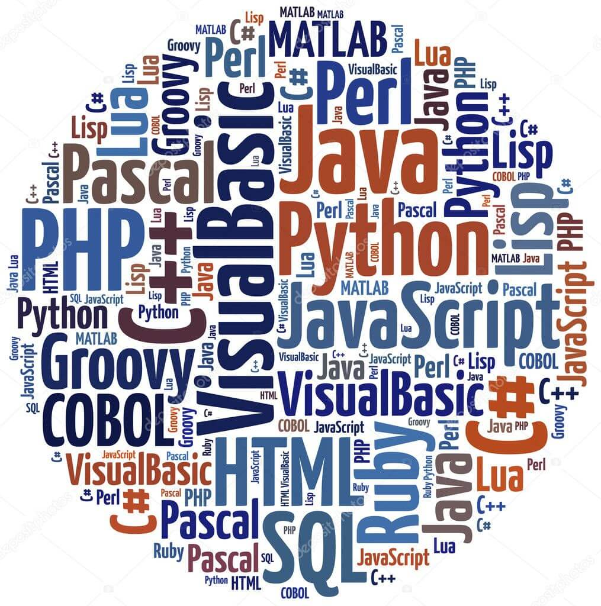

# Introduction à la programmation

Christophe Saint-Jean

[https://gitpitch.com/christophesaintjean/cours/IntroProgS1](https://gitpitch.com/christophesaintjean/cours/IntroProgS1)

Année 2018-2019

---

## Organisation de l'UE

### L'équipe enseignante

* Christophe Saint-Jean (Cours/TP - Resp.)
* Laurent Mascarilla (TP)
* El Hadi Zahzah (TP)
* Renaud Péteri (TP)
* *Etc*

---

### Communication

* Questions pédagogiques : [Moodle](https://moodle.univ-lr.fr/)
  * Appronfondissement/Questions (Forum)
  * Organisation de l'UE/Planning (Messages privés)
* Questions administratives (Secrétariat)
  * Appartenance groupes TD/TP
  * Absences/Justifications

---

### Dispositif horaire

* 5 cours de 1,5 heures (Amphithéâtre)
* 10 TPs de 1,5 heures (Sallles de TP)
* 2 créneaux de 1,5h de TEA (Salles de TP)

---

### Evaluation

$$Session~1 = \frac{CC_1+CC_2}{2}$$
$$Session~2 = CC_3$$

Les CC se passent en TP sur machine:

* Une partie QCM
* Une partie évaluée par un enseignant
* Attention à la règle sur les absences
* Le TEA sera pris en compte dans l'évaluation

---

## Les objectifs de cet enseignement

* Découvrir les bases de la programmation informatique
* Maîtriser des concepts
* Appprendre un des langages support de votre formation
* Libérer votre créativité

---

## *Sondage !*



---

## Langage humain vs langage informatique

Communication humaine:

* Un certain vocabulaire, une orthographe, des règles de grammaire communes
* Grande expressivité et diversité
* Même si l'on commet des erreurs, nous sommes capables de comprendre "globalement"

Communication informatique:

* Le vocabulaire est très réduit
* Pas ou peu encore d'expressivité
* Pas de tolérance aux erreurs de communication

---

## Les types de langages de programmation

* Langages impératifs (Python, C/C++)
* Langages à objets
* Langages fonctionnels (Javascript, OCAML, Haskell)
* Langages déclaratifs (HTML)

---

## Quelques exemples de code (Hello World)

* En python:

  ```python
  print('hello world')
  ```

* En java:

  ```java
  public class HW {
      public static void main(String[] args) {
        System.out.println('hello world');
      }
  }
  ```

  ---

## Programmer

```python
import os
```

$$\alpha = 3$$