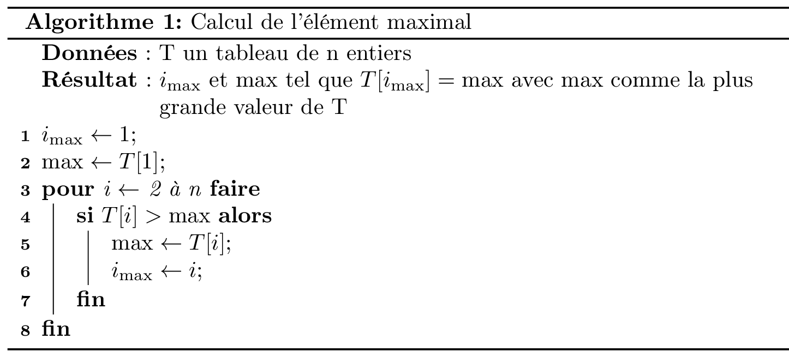
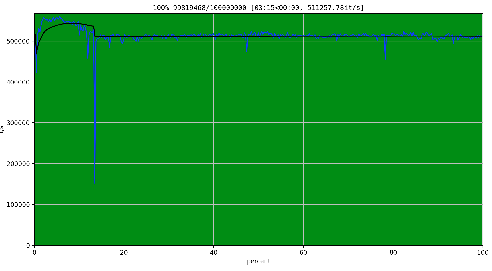
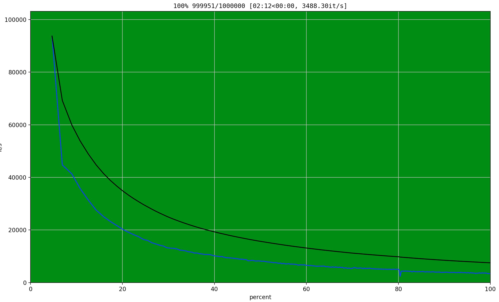
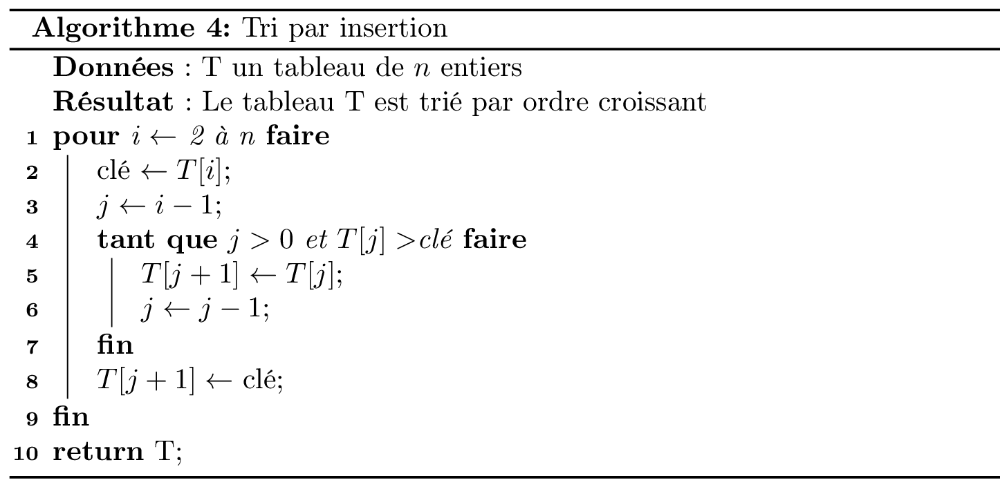
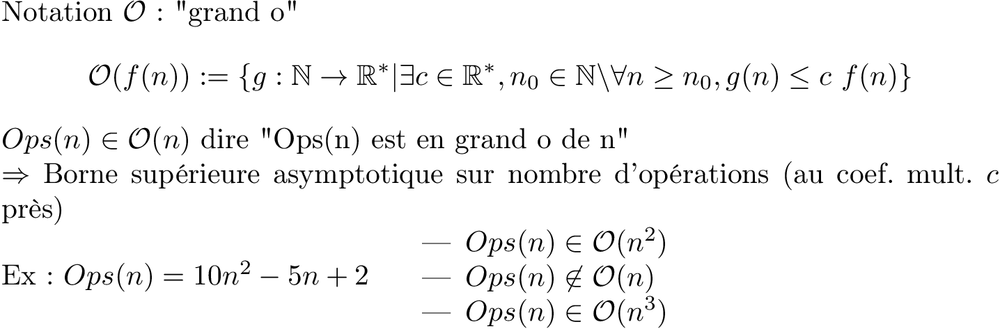
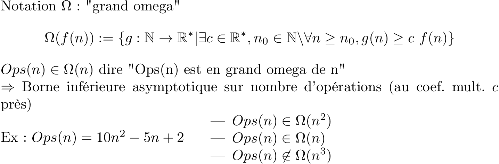
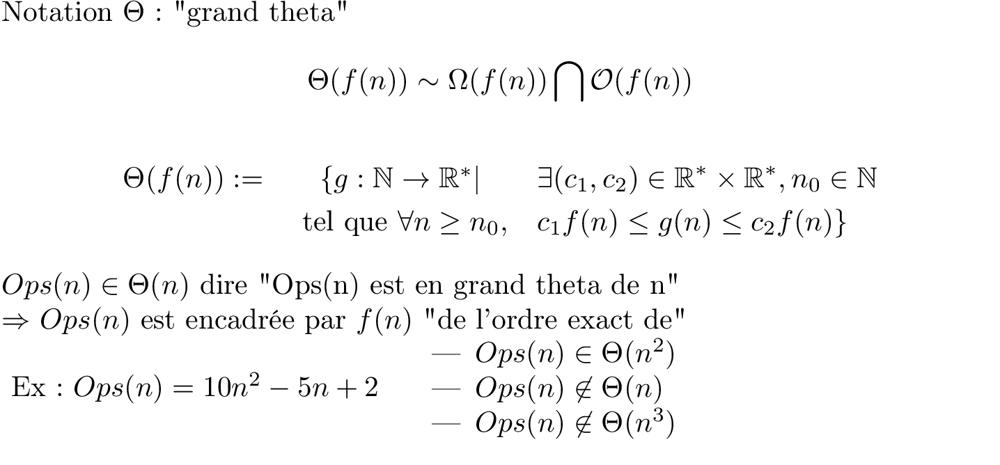
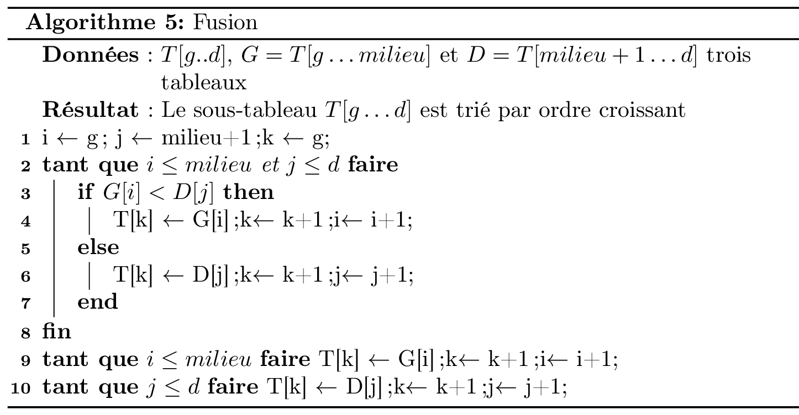
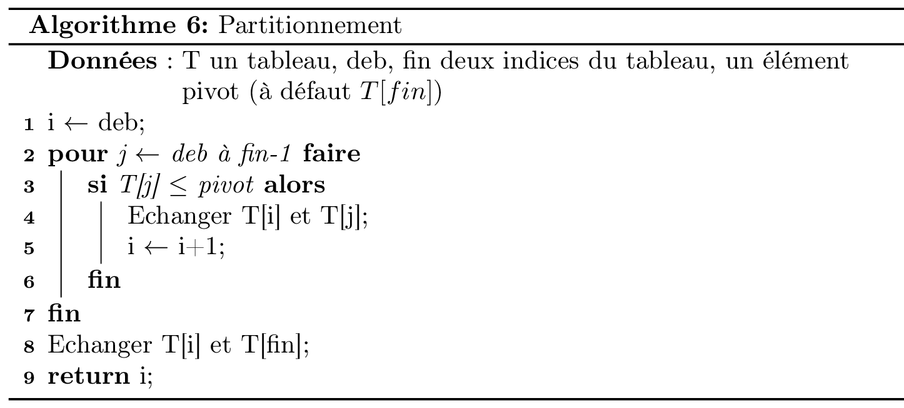

<style>
.reveal section img { background:none; border:none; box-shadow:none; }
</style>

# Algorithmique des tableaux

Christophe Saint-Jean

[Transparents du cours](https://gitpitch.com/christophesaintjean/cours/AlgoTabS2)

[Code du cours](https://tinyurl.com/ycq9smp7)

Année 2018-2019

---

@transition[fade]

## Organisation de l'UE

+++

### Mentions Légales

<a rel="license" href="http://creativecommons.org/licenses/by-nc-sa/4.0/"></a><br />Ce(tte) œuvre est mise à disposition selon les termes de la <a rel="license" href="http://creativecommons.org/licenses/by-nc-sa/4.0/">Licence Creative Commons Attribution - Pas d’Utilisation Commerciale - Partage dans les Mêmes Conditions 4.0 International</a>.

+++

### L'équipe enseignante

* **Christophe Saint-Jean** (CM/TD/TP - Resp.)
* Laurent Mascarilla (TD/TP)
* El Hadi Zahzah (TD/TP)

+++

### Communication

* Questions pédagogiques : [Moodle](https://moodle.univ-lr.fr/)
  * Appronfondissement/Questions (Forum)
  * Organisation de l'UE/Planning (Messages privés)
* Questions administratives (Secrétariat)
  * Appartenance groupes TD/TP
  * Absences/Justifications

+++

### Dispositif horaire

@ul

* 6 cours de 1,5 heures (Amphithéâtre)
* 4 TDs de 1,5 heures
* 5 TPs de 1,5 heures (Sallles de TP)
* 4 créneaux de 1,5h de TEA (Salles de TP)

@ulend

+++

### Evaluation

$$S_1 = \frac{CC_1+CC_2}{2}$$

$$S_2 = CC_3$$

Les CC se passent *a priori* en TP 3 et 5 sur machine.
Attention à la règle sur les absences

+++

### Les objectifs de cet enseignement

* Initiation à l'algorithmique
  * Qu'est ce qu'un algorithme ?
  * Différence algorithme / programme (cf. TD)
  * Initiation à l'analyse d'un algorithme.
* Approfondir vos connaissances sur :
  * les listes, tableaux, fonctions.
  * le langage Python.
* Découvrir des algorithmes simples et les analyser.
* Initiation à la récursivité.

---

@transition[fade]

## Généralités sur l'algorithmique

+++

### Algorithme (Définition)

```Un algorithme est la description d’une méthode de calcul qui, à partir d’un ensemble de données d’entrée (problème) et une suite finie d'étapes, produit un ensemble de données en sortie (solution).```

+++

### Analogie recette

1. Mettez la farine dans un saladier avec le sel et le sucre.
2. Faites un puits au milieu et versez-y les œufs légèrement battus à la fourchette.
3. Commencez à incorporer doucement la farine avec une cuillère en bois. Quand le mélange devient épais, ajoutez le lait froid petit à petit.
4. Quand tout le lait est mélangé, la pâte doit être assez fluide, si elle vous paraît trop épaisse, rajoutez un peu de lait. Ajoutez ensuite le beurre fondu, mélangez bien.
5. Faites cuire les crêpes dans une poêle chaude.
6. Répétez jusqu'à épuisement de la pâte.

* Langage de description intelligible
* Instructions séquentielles, fonctions, répétitives.

+++

### Algorithme 1/4

```Un algorithme est la description d’une méthode de calcul qui, à partir d’un ensemble de données d’entrée (problème) et une suite finie d'étapes, produit un ensemble de données en sortie (solution).```

**_Description_**

On doit décrire chaque fonction (sous-algorithmes) et structures de données employées

+++

### Algorithme 2/4

```Un algorithme est la description d’une méthode de calcul ...```

**_Méthode de calcul_**

Il ne peut résoudre que des problèmes calculables.
On démontre que certains problèmes ne sont pas calculables (décidables).

Ex.: Problème de l'arrêt

+++

### Algorithme 3/4

```Un algorithme est .... et une suite finie d'étapes, produit un ensemble de données en sortie (solution).```

**_Une suite finie d'étapes_**

Attention, ne pas confondre:

* Une séquence d’instructions qui se termine.
* Une description de longueur finie ⇒ possibilité de boucle infinie.

+++

### Algorithme 4/4

```Un algorithme est ... , produit un ensemble de données en sortie (solution).```

**_Solution_**

L'algorithme apporte t'il une solution au problème posé ?

+++

### Algorithmique (Définition)

```L'algorithmique est la science qui étudie les algorithmes pour eux-même indépendamment de tout langage de programmation.```

d'après "Al Khwarizmi", surnom du mathématicien arabe [Muhammad Ibn Musa](https://fr.wikipedia.org/wiki/Al-Khw%C3%A2rizm%C3%AE) (IX siècle).

+++

### Algorithmique (Histoire)

L'algorithmique et les algorithmes sont bien antérieurs à l'informatique:

* Abaques grecques, romaines, [PGCD d'Euclide](https://fr.wikipedia.org/wiki/Algorithme_d%27Euclide) (IIIème siècle av. J.-C.)
* [Boulier chinois](https://fr.wikipedia.org/wiki/Soroban) (XIIIème siècle)
* [Pascaline](https://fr.wikipedia.org/wiki/Pascaline) (1646)

+++

### Questions de l’algorithmique

1. L’algorithme A est t'il correct ?
2. L’algorithme A se termine t’il ?
3. L’algorithme A est t’il plus efficace qu’un algorithme B ?

Parallèlement, des questions plus fondamentales:

* Est il possible de trouver un algorithme qui resoud un problème P ? (Décidabilité)
* Si, oui existe t’il un algorithme efficace pour le résoudre ? (Classes de complexité)

+++

### Exemple d'algorithme (cf. S1)

```
Algorithme : Approx. π
Données : n (entier) nombre de termes
Résultat : Une approximation décente de π
S <- 0
Pour k<-0 à n-1 Faire:
    Ajouter (-1)^k/(2k+1) à S;
Retourner S;
```

* Correction: Convergence de la série (math)
* Terminaison: Oui.
* Efficacité: La vitesse de convergence (math).

---

@transition[fade]

## Description d'un algorithme

On utilisera un langage de description d'un algorithme appelé **pseudo-code**.

+++

### Caractérisques du pseudo-code

* Il ne doit pas être attaché la syntaxe d'un langage informatique particulier.
* Il doit être lisible par un non-programmeur.
* Être capable de décrire les structures de contrôle des langages impératifs (If, While, For, ...).

+++

### Décrire l'interface de l'algorithme

* Quelques sont les entrées attendues par l'algorithme ?
  * Type : Nombre, Tableau, Liste, Arbre, etc ...
  * Taille : nombre de bits, nombre d'éléments du tableau, nombre de feuilles, ...
  * Propriétés : entiers positifs, tableau trié, ...
* Que fait/produit l'algorithme ?
  * _Idem_ que sur les entrées
  * Description textuelle (éventuelle) de l'algorithme

+++

### Les types utilisables

Types de données élémentaires :

* Variables simples : booléen, entier, réel, caractère
* Tableaux
* *Pointeurs*

Cela permet de définir des structures de plus haut niveau:

* Chaîne de caractères
* Ensemble, Collection
* Liste, *table de hachage*
* *Graphes, ...*

+++

### Quelques instructions du pseudo-code 1/3

* Affectation : <-
* Test : =
* Opérations arithm ́etiques : +,-,*,/
* Séparateur d’instructions : ” ;”
* Elements d’un tableau T : ”T[i]” (convention 1..n !!)
* Adresse d’une variable ”@”
* Instruction de retour : Retourner <val. sortie>

+++

### Quelques instructions du pseudo-code 2/3

* Le branchement conditionnel :
  
  ```
  Si <condition> alors  
    <blocsi>  
  sinon  
    <blocsinon>
  finSi
  ```

+++

### Quelques instructions du pseudo-code 3/3

* Les itératives et les répétitives :  

```
  Pour i <- 1 à n [par pas de 1] faire  
     <bloc>  
  finPour
  
  Tant que <condition> faire
     <bloc>  
  finTq
```

+++

### Exemple 1



+++

### Analyse: Preuve de terminaison

@ul

* Vérifier que chaque instruction simple se termine:
  * calcul simple, affectation OK
  * affichage OK
  * Appel de fonction -> à vérifier
* Pour les boucles for,  s'assurer que la séquence parcourue est taille finie.
* Pour la répétitive While, s'assurer que dans tous les cas que la condition de continuation sera fausse au moins une fois.

@ulend

+++

### Analyse : Preuve de correction

Il est question de prouver que l'algorithme fait ce qu'il dit faire !

On utilise souvent un invariant de boucle et la preuve par récurrence.

```
Un invariant de boucle est une propriété
qui est vraie avant et après chaque répétition
```

Rappel récurrence: Initialisation et Hérédité.

+++

### Analyse : Complexité algorithmique 1/2

L'algorithme est il rapide ?

Pour un tableau T de taille *n*, la rapidité *devrait* dépendre de:

@ul

* *n* la taille *T*.
* d'une propriété, du contenu de *T*.
* du langage de programmation ?

@ulend

+++

### Analyse : Complexité algorithmique 2/2

Les outils du jour:

* Mesurer le temps d'exécution du programme implémentant l'algorithme (module time)
* Tracer une courbe (module matplotlib)
* Le module tqdm

+++

### Exemple 2


---

@transition[fade]

## Tableaux et Listes

+++

### Liste

Une **liste** est une structure de données qui contient une séquence de valeurs.

Syntaxe:

```python
[<valeur_1>, <valeur_2>, ..., <valeur_n>]
```

* Les valeurs ne sont pas nécessairement de même type.
* Une liste est une séquence

+++

#### Organisation de la mémoire

* La mémoire peut être vue comme un long ruban avec des zones protégées
* Chaque case mémoire (un octet) dispose d'une adresse propre.
* Le stockage d'une valeur peut prendre plusieurs octets.
* Certaines valeurs peuvent être de type "adresse" (8 octets ?)

+++

#### Tableau en mémoire

* Usuellement un ensemble de cases **contigues** en mémoire
* On fait de l'arithmétique avec la taille d'un objet pour trouver la position d'un élément
* Avantage: Accès direct (rapide) à un élément
* Inconvénient: Pas idéal pour des mises à jour (ajout, insertion, suppression)

+++

### Liste simplement (ou doublement) chainée

* Chaque élément connait son successeur (et prédecesseur si doublement chainée).
* Dispersion des éléments en mémoire
* Une valeur spéciale indique la fin (et le début) de liste.
* Avantage: idéal pour des mises à jour (ajout, insertion, suppression)
* Inconvénient: Accès séquentiel à un élément (très lent si longue liste)

+++

#### Tableau ou Liste ?

On doit faire un compromis entre efficacité de l'accès et des mises à jour.

* Dépend des langages de programmation (Python vs C)
* Python est un langage orienté objet

```
Bytes    type        scaling notes
28       int         +4 bytes about every 30 powers of 2
64      list        +8 for each additional
```

+++

#### Organisation d'une liste en Python 1/2

Même vide, une liste occupe de l'espace mémoire

```python
In [1]: import sys
In [2]: sys.getsizeof([])
Out[2]: 64
```

+++

#### Organisation d'un liste en Python 2/2

```python
In [3]: sys.getsizeof([1]), sys.getsizeof([1, 5])
Out[3]: 72, 80

In [4]: L = [1, 5]

In [5]: sys.getsizeof(L[1])
Out[5]: 28
```

+++

### Append



+++

### Insert



+++

### Ajout en tête

Quel est la meilleure solution pour le "prepend" (ajout en tête)?

* Insertion systématique en position 0.
* Append pour chaque élement puis reverse à la fin.

+++

### Conclusions 1/2

Classification (parcours, reallocation, cout)

* L[index]
* append
* insert(index, objet)
* remove(valeur)
* pop(index)
* pop()
* index(valeur)

+++

### Conclusions 2/2

* Les listes en Python fonctionnent comme des tableaux dynamiques
  
  *Facteur de croissance de la taille de la liste* = [1,125](https://hg.python.org/cpython/file/tip/Objects/listobject.c)
* Les listes doublement chainées existent (-> collections.dequeue)

---

## Compléments sur les listes

+++

### Listes en compréhension 1/2

```python
L = [expression for x in iterable if condition]
```

où *iterable* est une séquence (liste, range, chaine, ...)

* La condition est optionnelle.
* Le résultat est une liste.
* En général sur une seule ligne.

+++

### Listes en compréhension 2/2

Quelques usages:

* Construire une liste à partir de *range*.
* Créer une liste à partir d'une autre (filtrage)
* Se substituer à un *for* simple.
* Une liste de listes.

+++

### Parcours simultané de plusieurs listes 1/4

```python
zip(*iterables)
```

où *iterables désigne 0, 1, 2, ... objets iterables (liste, chaine, dict, ...)

* le type retourné est *zip* qui est iterable ;)

```python
In [1]: type(zip())
Out[1]: zip
```

+++

### Parcours simultané de plusieurs listes 2/4

```python
In [1]: L1 = [2, 3, 5]

In [2]: L2 = ['m', 'e', 't']

In [3]: for x in zip(L1, L2):
    ...:     print(x)

(2, 'm')
(3, 'e')
(5, 't')
```

+++

### Parcours simultané de plusieurs listes 3/4

L'usage classique est:

```python
In [4]: for x1, x2 in zip(L1, L2):
    ...:     print(x1, '---', x2)

2 --- m
3 --- e
5 --- t
```

+++

### Parcours simultané de plusieurs listes 4/4

On s'arrête sur la plus courte séquence:

```python
In [5]: L1 = [2, 3, 5, 6, 1, 4]

In [6]: for x1, x2 in zip(L1, L2):
    ...:     print(x1, '---', x2)

2 --- m
3 --- e
5 --- t
```

---

## Tris et rangs

+++

### Définition

On définit le problème du tri comme:

Entrée: une séquence de valeurs $a_1, a_2, ..., a_n$

Sortie: une **permutation** $\sigma$ (un réarrangement) telle que
$$a_{\sigma(1)}, a_{\sigma(2)}, ..., a_{ \sigma(n)}$$
soit **ordonnée**.

+++

### Clé de tri

On parle de **clé de tri** pour désigner l'élément sur lequel l'ordre est mis en place.

* Type de clé usuelles: nombre, chaine, liste
* Clé définie par l'utilisateur
* Clé simple dans une structure plus complexe (tuple)

+++

### Classification des algorithmes de tri 1/3

Définition: Tri en place ou non

Un algorithme de tri est dit **en place** lorsque jamais plus d'un *nombre constant* d'éléments est stocké hors du tableau.

+++

### Classification des algorithmes de tri 2/4

Définition: Tri stable

Un algorithme de tri est dit **stable** lorsque l'ordre des éléments ayant une *clé identique* est maintenu.

On peut rendre stable un algorithme de tri en introduisant une clé secondaire.

+++

### Classification des algorithmes de tri 3/4

* Un algorithme de tri peut utiliser des comparaisons "<"
* ou non...

+++

### Classification des algorithmes de tri 4/4

* Un algorithme de tri est **incrémental** si il est succeptible de traiter les données une par une sans disposer du tableau en entier.

---

## Tri par sélection


+++

### Caractéristiques: Tri par sélection

Implementé tel quel, c'est un tri:

@ul

* en place
* stable
* par comparaison
* non incrémental

@ulend

+++

### Analyse du Tri par sélection

* Terminaison
* Correction
* Nombre de d'éléments parcourus ?
* Nombre d'échanges ?

---

## Tri par insertion



+++

### Tri par insertion (démo)


[source: Tri par insertion (Wikipédia)](https://fr.wikipedia.org/wiki/Tri_par_insertion)

+++

### Caractéristiques: Tri par insertion

Implementé tel quel, c'est un tri:

@ul

* en place
* stable (car inf. strict)
* par comparaison
* incrémental

@ulend

---

## Efficience d'un algorithme

+++

### Taille d'un problème

L'efficacité d'un algorithme dépend généralement la taille des données en entrée:

* Taille d'un tableau ou d'une liste
* Longueur d'une chaîne de caractères
* Taille d'un fichier
* Quantité d'informations (nombres de bits) pour coder une information

**Il est donc pertinent d'étudier l'efficience d'un algorithme par rapport à la taille des données en entrée**.

+++

### Cas où *n* est "petit"

Pour des problèmes de taille petite:

* L'architecture de la machine est prépondérante
* Les "caches" (pré-calculs) sont utilisés implicitement pour accélérer les calculs.

Il est difficile de comparer deux algorithmes dans ce cas là.

=> Mesure fine du temps d'éxecution (ex.: module *timeit*).

+++

### Cas où *n* est grand 1/4

Pour des problèmes de grande taille:

* Les "caches" sont insuffisants pour accélérer les calculs.
* On doit l'évolution de *Ops* en fonction de *n*:
  * Nombre de cases parcourues
  * Nombre d'échanges pour un tri en place
  * Nombre de comparaison

+++

### Cas où *n* est grand 2/4

Comme nos algorithmes ont

* des branchements conditionnels
* des boucles "Tant que"
  
**le nombre d'opérations élémentaires Ops(n) varie même pour n fixé**.

+++

### Cas où *n* est grand 3/4

On parlera donc de:

* Borne sup : "pire des cas", ie trouver une configuration de la donnée qui maximise *Ops(n)*.
* Borne inf : "meilleur des cas", ie trouver une configuration de la donnée qui minimise *Ops(n)*.
  
$$Meilleur <= Réaliste <= Pire$$

+++

### Cas où *n* est grand 4/4

On regarde ainsi l'évolution de ses bornes (cet encadrement) en fonction de *n*.

On va se doter d'une notation pour décrire cet encadrement.

On parle des notations de *Landau*.

---

## Notations de Landau

+++

### Notation 'grand o' pour la borne sup



+++

### Notation 'grand omega' pour la borne inf



+++

### Notation 'grand theta'



+++

### Echelle de comparaison

| notation  |  grandeur au plus |
|---|---|---|---|---|
| O(1)  |  module majoré par une constante |
| O(log(n))  |  logarithmique  |
| O(n) |  linéaire  |
| O(n log(n)) | quasi-linéaire |
| O($n^2$) | quadratique |
| O($n^c$)| polynomial d'ordre c|
| O($c^n$) | exponentiel |

+++

### Applications aux algorithmes déjà rencontrés

@ul

* Calcul du min/max: $\varTheta(n)$
* Recherche d'un élément: $\varOmega(1)$ et $O(n)$
* Tri par sélection: $\varTheta(n^2)$
* Tri par insertion: $\varOmega(n)$ et $O(n^2)$
  moyenne : $n^2 / 4$

@ulend

---

## Stratégie Diviser pour Régner

* Simplifier un problème en tâches plus simples
* Fusionner les résultats

+++

### Tri par fusion (merge sort)

Principe:

* T est un tableau de taille n
* Partitionner T en deux parties égales (taille n/2) -> Gauche, Droite
* Trier récursivement **Gauche** et **Droite** (parallèle possible)
* Fusionner **Gauche** et **Droite** en *T*

+++

#### Tri Fusion: partitionnement 1/2

* g, d les indices désignant un sous-tableau de *T*
* Le milieu : mil = (g + d) / 2 (div entière)
* On doit donc trier T[g..mil]  et T[mil+1..d]

+++

#### Tri Fusion: partitionnement 2/2

```python
def partitionnement (T, g, d):
    mil = (g + d) // 2
    return T[g:mil],  T[mil+1:d]
```

+++

#### Tri Fusion: Fusion 1/2

Principe:

* Parcourir simultanément **Gauche** et **Droite**
* Recopier l'élement minimal entre les deux valeurs courantes
* Augmenter l'indice sur le tableau qui contenait ce minimum.
* Continuer jusqu'a avoir recopier **Gauche** et **Droite**

+++

#### Tri Fusion: Fusion 2/2



+++

#### Tri Fusion: Preuves

@ul

* Terminaison: Fin de la récursivité
* Correction de l'algorithme = Correction de la fusion
* Efficience: Ops(n) $\in \varTheta$(n log n)

@ulend

+++

#### Tri Fusion: Caractéristiques

@ul

* Tri par comparaison
* Tri stable
* Tri qui n'est pas en place ...
  > Utilisation de la mémoire: $\varTheta(n)$
* Donc un tri extrêmement efficace

@ulend

+++

#### Fusion sans tableau auxiliaire 1/4

Astuce : l'arithmétique modulo n
ou "Comment stocker 2 nombres en 1" ?

Rappel du premier semestre:
>Pour tout $n1, n2$,  on a  $n1 = ( n1 // n2 ) * n2 + ( n1 \% n2)$

* $n1 // n2$ est le quotient
* $n1 \% n2$ est le reste qui est **obligatoirement** dans $[0, n2-1]$.

+++

#### Fusion sans tableau auxiliaire 2/4

Soient a, b, m trois nombres tels que $a < m$  et $b < m$

Si on exécute $c = a + (b \% m) * m$ alors

* $c // m$ vaut b
* $c \% m$ vaut a

```python
In [1]: a, b, m = 3, 5, 6
In [2]: c = a + (b % m) * m
In [3]: c // m, c % m
Out[3]: (5, 3)
```

+++

#### Fusion sans tableau auxiliaire 3/4

Application à la fusion de deux tableaux triés:

* Déterminer $m$ comme le plus grand élément + 1
* En comparant T[i] (sous-tableau gauche) et T[j] (sous-tableau droite), on choisit $b$ comme le + petit des deux.
* On stocke le résultat dans le quotient de T[k]:
  
   $$T[k] = T[k] + (b \% m) * m$$

+++

#### Fusion sans tableau auxiliaire 4/4

Résultats:

* Tri Fusion standard:
  * Fusion en 1 passe $\varTheta(n)$
  * Mémoire supp.: une copie du tableau

* Tri Fusion Bis:
  * Fusion en 3 passes ... $\varTheta(n)$
  * Mémoire supp.: aucune !

Conclusion: Privilégier la méthode standard si la mémoire n'est pas un problème !

---

### Tri rapide (quicksort)

* Utilisation du principe diviser pour régner
* Basé sur un partitionnement guidé des données (par rapport à imposé pour tri fusion)

+++



+++

### Partition: Invariant

> Tous les éléments de $[deb, i[$ sont $\leq$ à pivot<br>
> Tous les éléments de $[i, j[$ sont $>$ à pivot

* Initialisation: i = j = deb OK
* Récurrence:
  * Si T[j] <= pivot:
    * Echange de T[i] (> pivot) et T[j] ($\leq$ pivot)
    * i = i + 1, j = j + 1 => Proprieté préservée
  * Si T[j] > pivot:
    * j = j + 1 => Proprieté préservée
* En fin, échange de T[i] (> pivot) et T[fin] = pivot<br>
=> Proprieté préservée

+++

### Tri rapide

```python
def trirapide(T, g=0, d=None):
    if d is None:
        d = len(T)-1
    if g < d:
        ipivot = partition(T, g, d)
        trirapide(T, g, ipivot-1)
        trirapide(T, ipivot+1, d)
```

+++

### Tri rapide : Analyse partition

@ul

* Qu'est ce qu'un bon partitionnement pour le tri rapide ?
* Equilibré : n/2 éléments à gauche et à droite.

@ulend

@ul

* Qu'est ce qu'un mauvais partitionnement pour le tri rapide ?
* Deséquilibré : n-1 et 1 élements
* Tout cela dépend:
  * la stratégie de choix du pivot.
  * du contenu tableau... humm pourquoi ?

@ulend

+++

### Tri rapide : Choix du pivot

@ul

* Choix systématique: premier, dernier élément => mauvais
* Choix systématique: la valeur de l'élément au milieu => pourquoi pas ?
* La médiane de trois nombres tirés au hasard => bien mieux

@ulend

+++

### Tri rapide : Analyse du tri

@ul

* Si le partitionnement est mauvais:
  $$Ops(n) = Ops(n-1) + Ops(1) + n$$
  $$... \Rightarrow Ops(n) \in O(n^2)$$
* Si le partitionnement est parfait:
  $$Ops(n) = 2 Ops(n/2) + n$$
  $$... \Rightarrow Ops(n) \in \varOmega(n log_2(n))$$
* [Analyse en moyenne (hors cadre du cours)](http://imss-www.upmf-grenoble.fr/prevert/Prog/Tris/triRapideEval.html)
    $$E[Ops(n)] \in \varTheta(n log_2(n))$$
  
@ulend

+++

### (Bonus) Tri rapide : Problème 1/2

@ul

* Question: Existe t'il toujours une stratégie donnant lieu à un partitionnement équilibré ???
* Réponse: Non !!! si le tableau contient de nombreux doublons
* Conséquences: Explosion du nombre d'appels récursifs
* Solution: Améliorer le partitionnement
  
@ulend

+++

### (Bonus) Tri rapide : Problèmes 2/2

Découper en trois parties:

* les éléments <
* les éléments =
* les éléments >

et ne trier récursivement que les deux extrémités.

Exercice: Ecrire une telle fonction de partitionnement<br>
(*Connu également sous le nom de "Drapeau hollandais"*)

+++

### Tri rapide : Conclusion

@ul

* Tri par comparaison, stable, en place, récursif
* Pire des cas: $O(n^2)$
* Meilleur des cas: $\varOmega$(n log n)
* Efficience proche de l'optimal (n log n) même en moyenne
* Il existe de bonnes stratégies:
  * de choix de pivot (Ex.: médiane de 3)
  * de partionnement pour éviter les cas de doublons
* Amélioration: pour des tableaux de petite taille -> Tri par insertion

@ulend

---

## Conclusion sur les tris 1/2

| Tri  |  pire | meilleur | Commentaires |
|-|-|-|-|
| par sélection  |  $n^2$ | $n^2$ | Inefficace |
| par insertion  |  n | $n^2$  | Eff. petits tableaux |
| à bulles |  n  | $n^2$ | Bcp. d'échanges |
| fusion | n log n | n log n | Mém. aux. + dépl. |

+++

### Conclusion sur les tris 2/2

| Tri  |  pire | meilleur | Commentaires |
|-|-|-|-|
| rapide | n log n | $n^2$ | proche de l'opt., - dépl.|
| [Timsort](https://hackernoon.com/timsort-the-fastest-sorting-algorithm-youve-never-heard-of-36b28417f399)| n  | n log n | meilleur mais mém. aux.
| par comptage | n+k | n+k | Pas de comp., mém. aux.

---

## Recherche du k-ième élément

**Définition du problème**:

*Entrée*: T un tableau de n éléments (distincts) et k un nombre tel que 1 <= k <= n

*Sortie*: La valeur x appartenant à T tel que k-1 éléments de T sont inférieurs à x

+++

#### Exemples d'applications

* Quel est l'âge médian en France ? (40,8 contre 41,7 en moy.)
* Combien gagne les 10% les plus riches ?
* Détection les événements rares

---

### Exemples triviaux: Recherche min **ou** max

* k = 1 -> min
* k = n -> max

```python
def minimum(T):
    x = T[0]
    for e in T[1:]:
        if e < x:
            x = e
    return x
```

Analyse: n-1 comparaisons au minimum

---

### Exemples triviaux: Recherche min **et** max

```python
def minmax(T):
    min, max = T[0], T[0]
    for e in T[1:]:
        if e < min:
            min = e
        if e > max:
            max = e
    return min, max
```

Analyse: 2*(n-1) comparaisons au minimum

+++

#### Recherche min **et** max : Faire mieux 1/4

Supposons T[i] et T[j] deux éléments de T.

Dans l'algorithme précédent, 4 comparaisons pour calculer

* minimum(T[i], [j], min) : 2 comp.
* maximum(T[i], [j], max) : 2 comp.

+++

#### Recherche min **et** max : Faire mieux 2/4

Remarquons:

* minimum(T[i], [j]) **et** maximum(T[i], [j]): 1 comp.
* minimum(minimum(T[i], [j]), min): 1 comp.
* maximum(maximum(T[i], [j]), max): 1 comp.

Donc 3 comparaisons au lieu de 4 !

+++

#### Recherche min **et** max : Faire mieux 3/4

*Stratégie*:

* Prendre deux éléments successifs T[i] et T[i+1]
* Mettre à jour le min et max en 3 comparaisons
* Gérer les cas limites:
  * Tableau à 1 élément
  * Nombre impair d'éléments

+++

#### Recherche min **et** max : Faire mieux 3/3

*Analyse*:

> Pour tout couple: 3 comparaisons

> Soit env. 3*(n//2)=1.5*n comp. au lieu de 2*n

*Attention*:

* les fonctions natives min et max de Python sont implementées en C
* la fonction minmax n'existe pas dans le langage

+++

#### Recherche min **et** max : approche récursive

@ul

* Découpage en 2 parties égales
* Calcul des min et max  à gauche et à droite
* Fusion des résultats
* Simple, clair ...
* Mais lent !!

@ulend

---

### Recherche du 2ème plus petit élément 1/2

```python
def deuxieme(T):
    if len(T) == 1: return None
    if len(T) >= 2:
        first, sec = (T[0], T[1]) if T[0] < T[1] else (T[1], T[0])
    for e in T[2:]:
        if e < sec:
            if e < first:
                first, sec = e, first
            else:
                sec = e
    return sec
```

+++

#### Recherche du 2ème plus petit élément 2/2

*Analyse*:

@ul

* Au pire : 2*(n-2) + 1 comparaisons
* Au mieux: n-1 comparaisons
* C'est 2 fois plus que la recherche du min mais cela reste linéaire
* Que se passe t'il si on cherche le troisième plus petit ?
* Que se passe t'il si on cherche le k-ième plus petit ?

@ulend

---

### Recherche du k-ième plus petit élément (Quick-Select)

Pour T un tableau de taille n:

@ul

* Trier le tableau T
* Retourner l'élément en position k

@ulend

_Efficacité_:

@ul

* Tri par comparaison: $\varOmega(n \log n)$
* Tri par comptage: $\varTheta(n + k)$ où k est le nombre de clés.

@ulend

+++

#### Retour sur le partitionnement du Quicksort

Que dire de la position du pivot après partitionnement ?

@ul

* i_pivot = k : le k-ième élément est trouvé
* k < i_pivot : le k-ième élément se trouve dans le sous-tableau T[g..i_pivot-1]
* k > i_pivot : le k-ième élément se trouve dans le sous-tableau T[i_pivot+1..d]

@ulend

+++

#### Analyse du Quick-Select 1/2

@ul

* Cela ressemble à l'exécution partielle du tri rapide
* La dichotomie est effectuée est la position (vs valeur)
* Nombre de comparaisons:
  * Pire des cas (mauvais part.):<br>
    *Comp(n) = n + Comp(n-1)* -> *env. n(n+1)/2 = n^2*
  * Meilleur des cas :
            *Comp(n) = n*
  * [Cas moyen](https://stackoverflow.com/questions/5945193/average-runtime-of-quickselect):
            *E[Comp(n)]* $\in$ *O(n)*
* Dichotomie sur le rang: *n + n/2 + ... + 4 + 2 + * $\in$ O(n)*<br>
  (Somme des termes d'une suite géométrique)

@ulend

+++

#### Analyse du Quick-Select 2/2

* La récursivité n'apporte pas de lisibilité supplémentaire
* Trier par comparaison, c'est au minimum *n log n* comp.
* C'est donc trop pour le problème de sélection: env. *n* comp.
* Quick-Select est donc optimal pour le problème donné.
* Sa qualité dépend de la stratégie de choix du pivot (comme Quick-Sort)

---

### Recherche du k-ième plus petit élément (Comptage)

Nombre d'éléments parcourus:

@ul

* Calcul du min et max: *1.5 n*
* Comptage des clés: *n*
* Parcours des clés jusqu'à k: *k* (au pire k=n)

@ulend

Conclusion: linéaire mais en pratique doit être inférieur à Quick-Select (env. *1.5 n*)

---

## Recherche par Interpolation

Peut on faire mieux que la dichotomie pour la recherche dans un tableau trié ?

Oui parfois !!

+++

### Recherche par Interpolation : Principe 1/2

Cette technique ne s'applique que pour les tableaux trié de nombres

Principe: On estime l'indice de la valeur cherchée à partir de g,T[g], d, T[d]

+++

### Recherche par Interpolation : Principe 2/2

Technique: interpolation par une droite

* [Déterminer l'équation de la droite passant par (g,T[g]) et (d, T[d])](https://www.mathforu.com/seconde/determiner-equation-droite/)
* Résoudre x pour y égal à la valeur cherchée
* Arrondir à l'entier le + proche -> m
* Tester m
* Suivant résultat, chercher à droite ou à gauche (dichotomie !)

+++

### Recherche par Interpolation : Analyse

* Le partition est déterminée par heuristique
* Mauvais cas: donnés inhomogènes -> O(n)
* Meilleur cas: données homogènes -> O (log log n)
* Plus d'infos:
  * [Article Quora](https://www.quora.com/What-is-the-time-complexity-of-interpolation-search-and-why?awc=15748_1549964806_0e1797350d9e13b3e38677774aab1a88&uiv=6&txtv=8&source=awin&medium=ad&campaign=uad_mkt_en_acq_us_awin&set=awin)
  * [Papier original + preuve](http://www.cs.technion.ac.il/~itai/publications/Algorithms/p550-perl.pdf)
