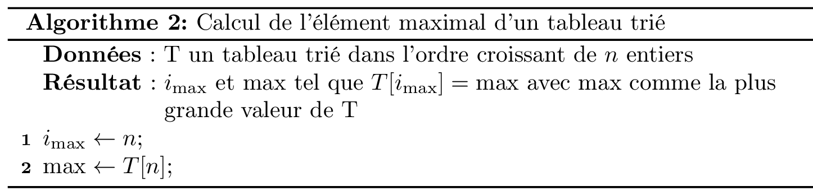
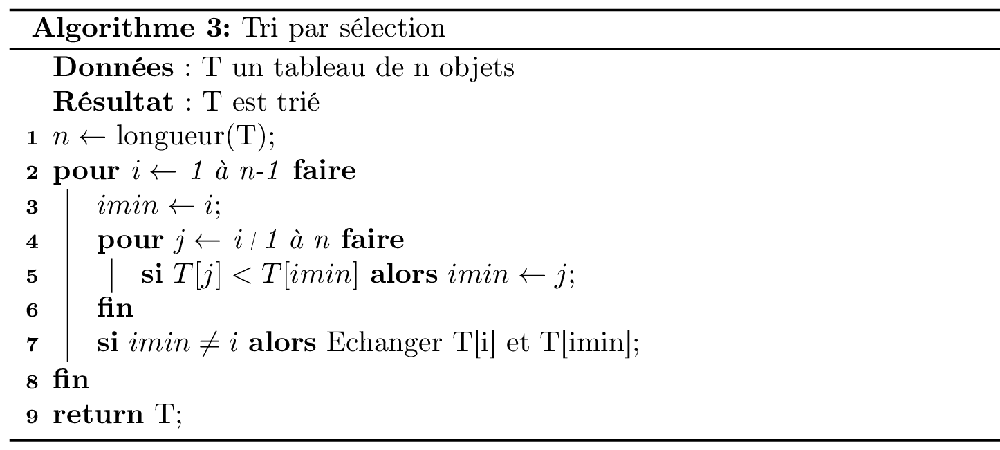

<style>
.reveal section img { background:none; border:none; box-shadow:none; }
</style>

# Algorithmique des tableaux

Christophe Saint-Jean

[Transparents du cours](https://gitpitch.com/christophesaintjean/cours/AlgoTabS2)

[Code du cours](https://tinyurl.com/ycq9smp7)

Année 2018-2019

---

@transition[fade]

## Organisation de l'UE

+++

### L'équipe enseignante

* **Christophe Saint-Jean** (CM/TD/TP - Resp.)
* Laurent Mascarilla (TD/TP)
* El Hadi Zahzah (TD/TP)

+++

### Communication

* Questions pédagogiques : [Moodle](https://moodle.univ-lr.fr/)
  * Appronfondissement/Questions (Forum)
  * Organisation de l'UE/Planning (Messages privés)
* Questions administratives (Secrétariat)
  * Appartenance groupes TD/TP
  * Absences/Justifications

+++

### Dispositif horaire

@ul

* 6 cours de 1,5 heures (Amphithéâtre)
* 4 TDs de 1,5 heures
* 5 TPs de 1,5 heures (Sallles de TP)
* 4 créneaux de 1,5h de TEA (Salles de TP)

@ulend

+++

### Evaluation

$$S_1 = \frac{CC_1+CC_2}{2}$$

$$S_2 = CC_3$$

Les CC se passent *a priori* en TP 3 et 5 sur machine.
Attention à la règle sur les absences

+++

### Les objectifs de cet enseignement

* Initiation à l'algorithmique
  * Qu'est ce qu'un algorithme ?
  * Différence algorithme / programme (cf. TD)
  * Initiation à l'analyse d'un algorithme.
* Approfondir vos connaissances sur :
  * les listes, tableaux, fonctions.
  * le langage Python.
* Découvrir des algorithmes simples et les analyser.
* Initiation à la récursivité.

---

@transition[fade]

## Généralités sur l'algorithmique

+++

### Algorithme (Définition)

```Un algorithme est la description d’une méthode de calcul qui, à partir d’un ensemble de données d’entrée (problème) et une suite finie d'étapes, produit un ensemble de données en sortie (solution).```

+++

### Analogie recette

1. Mettez la farine dans un saladier avec le sel et le sucre.
2. Faites un puits au milieu et versez-y les œufs légèrement battus à la fourchette.
3. Commencez à incorporer doucement la farine avec une cuillère en bois. Quand le mélange devient épais, ajoutez le lait froid petit à petit.
4. Quand tout le lait est mélangé, la pâte doit être assez fluide, si elle vous paraît trop épaisse, rajoutez un peu de lait. Ajoutez ensuite le beurre fondu, mélangez bien.
5. Faites cuire les crêpes dans une poêle chaude.
6. Répétez jusqu'à épuisement de la pâte.

* Langage de description intelligible
* Instructions séquentielles, fonctions, répétitives.

+++

### Algorithme 1/4

```Un algorithme est la description d’une méthode de calcul qui, à partir d’un ensemble de données d’entrée (problème) et une suite finie d'étapes, produit un ensemble de données en sortie (solution).```

**_Description_**

On doit décrire chaque fonction (sous-algorithmes) et structures de données employées

+++

### Algorithme 2/4

```Un algorithme est la description d’une méthode de calcul ...```

**_Méthode de calcul_**

Il ne peut résoudre que des problèmes calculables.
On démontre que certains problèmes ne sont pas calculables (décidables).

Ex.: Problème de l'arrêt

+++

### Algorithme 3/4

```Un algorithme est .... et une suite finie d'étapes, produit un ensemble de données en sortie (solution).```

**_Une suite finie d'étapes_**

Attention, ne pas confondre:

* Une séquence d’instructions qui se termine.
* Une description de longueur finie ⇒ possibilité de boucle infinie.

+++

### Algorithme 4/4

```Un algorithme est ... , produit un ensemble de données en sortie (solution).```

**_Solution_**

L'algorithme apporte t'il une solution au problème posé ?

+++

### Algorithmique (Définition)

```L'algorithmique est la science qui étudie les algorithmes pour eux-même indépendamment de tout langage de programmation.```

d'après "Al Khwarizmi", surnom du mathématicien arabe [Muhammad Ibn Musa](https://fr.wikipedia.org/wiki/Al-Khw%C3%A2rizm%C3%AE) (IX siècle).

+++

### Algorithmique (Histoire)

L'algorithmique et les algorithmes sont bien antérieurs à l'informatique:

* Abaques grecques, romaines, [PGCD d'Euclide](https://fr.wikipedia.org/wiki/Algorithme_d%27Euclide) (IIIème siècle av. J.-C.)
* [Boulier chinois](https://fr.wikipedia.org/wiki/Soroban) (XIIIème siècle)
* [Pascaline](https://fr.wikipedia.org/wiki/Pascaline) (1646)

+++

### Questions de l’algorithmique

1. L’algorithme A est t'il correct ?
2. L’algorithme A se termine t’il ?
3. L’algorithme A est t’il plus efficace qu’un algorithme B ?

Parallèlement, des questions plus fondamentales:

* Est il possible de trouver un algorithme qui resoud un problème P ? (Décidabilité)
* Si, oui existe t’il un algorithme efficace pour le résoudre ? (Classes de complexité)

+++

### Exemple d'algorithme (cf. S1)

```
Algorithme : Approx. π
Données : n (entier) nombre de termes
Résultat : Une approximation décente de π
S <- 0
Pour k<-0 à n-1 Faire:
    Ajouter (-1)^k/(2k+1) à S;
Retourner S;
```

* Correction: Convergence de la série (math)
* Terminaison: Oui.
* Efficacité: La vitesse de convergence (math).

---

@transition[fade]

## Description d'un algorithme

On utilisera un langage de description d'un algorithme appelé **pseudo-code**.

+++

### Caractérisques du pseudo-code

* Il ne doit pas être attaché la syntaxe d'un langage informatique particulier.
* Il doit être lisible par un non-programmeur.
* Être capable de décrire les structures de contrôle des langages impératifs (If, While, For, ...).

+++

### Décrire l'interface de l'algorithme

* Quelques sont les entrées attendues par l'algorithme ?
  * Type : Nombre, Tableau, Liste, Arbre, etc ...
  * Taille : nombre de bits, nombre d'éléments du tableau, nombre de feuilles, ...
  * Propriétés : entiers positifs, tableau trié, ...
* Que fait/produit l'algorithme ?
  * _Idem_ que sur les entrées
  * Description textuelle (éventuelle) de l'algorithme

+++

### Les types utilisables

Types de données élémentaires :

* Variables simples : booléen, entier, réel, caractère
* Tableaux
* *Pointeurs*

Cela permet de définir des structures de plus haut niveau:

* Chaîne de caractères
* Ensemble, Collection
* Liste, *table de hachage*
* *Graphes, ...*

+++

### Quelques instructions du pseudo-code 1/3

* Affectation : <-
* Test : =
* Opérations arithm ́etiques : +,-,*,/
* Séparateur d’instructions : ” ;”
* Elements d’un tableau T : ”T[i]” (convention 1..n !!)
* Adresse d’une variable ”@”
* Instruction de retour : Retourner <val. sortie>

+++

### Quelques instructions du pseudo-code 2/3

* Le branchement conditionnel :
  
  ```
  Si <condition> alors  
    <blocsi>  
  sinon  
    <blocsinon>
  finSi
  ```

+++

### Quelques instructions du pseudo-code 3/3

* Les itératives et les répétitives :  
  
```
  Pour i <- 1 à n [par pas de 1] faire  
     <bloc>  
  finPour
  
  Tant que <condition> faire
     <bloc>  
  finTq
```

+++

### Exemple 1


+++

### Analyse: Preuve de terminaison

@ul

* Vérifier que chaque instruction simple se termine:
    * calcul simple, affectation OK
    * affichage OK
    * Appel de fonction -> à vérifier
* Pour les boucles for,  s'assurer que la séquence parcourue est taille finie.
* Pour la répétitive While, s'assurer que dans tous les cas que la condition de continuation sera fausse au moins une fois. 

@ulend

+++

### Analyse : Preuve de correction

Il est question de prouver que l'algorithme fait ce qu'il dit faire !

On utilise souvent un invariant de boucle et la preuve par récurrence.

```
Un invariant de boucle est une propriété
qui est vraie avant et après chaque répétition
```

Rappel récurrence: Initialisation et Hérédité.

+++

### Analyse : Complexité algorithmique 1/2

L'algorithme est il rapide ?

Pour un tableau T de taille *n*, la rapidité *devrait* dépendre de:

@ul

* *n* la taille *T*.
* d'une propriété, du contenu de *T*.
* du langage de programmation ?

@ulend

+++

### Analyse : Complexité algorithmique 2/2

Les outils du jour:

* Mesurer le temps d'exécution du programme implémentant l'algorithme (module time)
* Tracer une courbe (module matplotlib)
* Le module tqdm

+++

### Exemple 2



---

@transition[fade]

## Tableaux et Listes

+++

### Liste

Une **liste** est une structure de données qui contient une séquence de valeurs.

Syntaxe:

```python
[<valeur_1>, <valeur_2>, ..., <valeur_n>]
```

* Les valeurs ne sont pas nécessairement de même type.
* Une liste est une séquence

+++
 
#### Organisation de la mémoire

* La mémoire peut être vue comme un long ruban avec des zones protégées
* Chaque case mémoire (un octet) dispose d'une adresse propre.
* Le stockage d'une valeur peut prendre plusieurs octets.
* Certaines valeurs peuvent être de type "adresse" (8 octets ?)

+++

#### Tableau en mémoire

* Usuellement un ensemble de cases **contigues** en mémoire
* On fait de l'arithmétique avec la taille d'un objet pour trouver la position d'un élément
* Avantage: Accès direct (rapide) à un élément
* Inconvénient: Pas idéal pour des mises à jour (ajout, insertion, suppression)

+++

### Liste simplement (ou doublement) chainée

* Chaque élément connait son successeur (et prédecesseur si doublement chainée).
* Dispersion des éléments en mémoire
* Une valeur spéciale indique la fin (et le début) de liste.
* Avantage: idéal pour des mises à jour (ajout, insertion, suppression)
* Inconvénient: Accès séquentiel à un élément (très lent si longue liste)

+++

#### Tableau ou Liste ?

On doit faire un compromis entre efficacité de l'accès et des mises à jour.

* Dépend des langages de programmation (Python vs C)
* Python est un langage orienté objet

```
Bytes    type        scaling notes
28       int         +4 bytes about every 30 powers of 2
64      list        +8 for each additional
```

+++ 

#### Organisation d'une liste en Python 1/2

Même vide, une liste occupe de l'espace mémoire

```python
In [1]: import sys
In [2]: sys.getsizeof([])
Out[2]: 64
```

+++

#### Organisation d'un liste en Python 2/2

```python
In [3]: sys.getsizeof([1]), sys.getsizeof([1, 5])
Out[3]: 72, 80

In [4]: L = [1, 5]

In [5]: sys.getsizeof(L[1])
Out[5]: 28
```

+++

### Append


+++

### Insert


+++

### Ajout en tête

Quel est la meilleure solution pour le "prepend" (ajout en tête)?

* Insertion systématique en position 0.
* Append pour chaque élement puis reverse à la fin.

+++

### Conclusions 1/2

Classification (parcours, reallocation, cout)

* L[index]
* append
* insert(index, objet)
* remove(valeur)
* pop(index)
* pop()
* index(valeur)

+++

### Conclusions 2/2

* Les listes en Python fonctionnent comme des tableaux dynamiques
  
  *Facteur de croissance de la taille de la liste* = [1,125](https://hg.python.org/cpython/file/tip/Objects/listobject.c)
* Les listes doublement chainées existent (-> collections.dequeue)

---

## Compléments sur les listes

+++

### Listes en compréhension 1/2

```python
L = [expression for x in iterable if condition]
```

où *iterable* est une séquence (liste, range, chaine, ...)

* La condition est optionnelle.
* Le résultat est une liste.
* En général sur une seule ligne.

+++

### Listes en compréhension 2/2

Quelques usages:

* Construire une liste à partir de *range*.
* Créer une liste à partir d'une autre (filtrage)
* Se substituer à un *for* simple.
* Une liste de listes.

+++

### Parcours simultané de plusieurs listes 1/4

```python
zip(*iterables)
```

où *iterables désigne 0, 1, 2, ... objets iterables (liste, chaine, dict, ...)

* le type retourné est *zip* qui est iterable ;)

```python
In [1]: type(zip())
Out[1]: zip
```

+++

### Parcours simultané de plusieurs listes 2/4

```python
In [1]: L1 = [2, 3, 5]

In [2]: L2 = ['m', 'e', 't']

In [3]: for x in zip(L1, L2):
    ...:     print(x)

(2, 'm')
(3, 'e')
(5, 't')
```

+++

### Parcours simultané de plusieurs listes 3/4

L'usage classique est:

```python
In [4]: for x1, x2 in zip(L1, L2):
    ...:     print(x1, '---', x2)

2 --- m
3 --- e
5 --- t
```

+++

### Parcours simultané de plusieurs listes 4/4

On s'arrête sur la plus courte séquence:

```python
In [5]: L1 = [2, 3, 5, 6, 1, 4]

In [6]: for x1, x2 in zip(L1, L2):
    ...:     print(x1, '---', x2)

2 --- m
3 --- e
5 --- t
```

---

## Tris et rangs

+++

### Définition

On définit le problème du tri comme:

Entrée: une séquence de valeurs $a_1, a_2, ..., a_n$

Sortie: une **permutation** $\sigma$ (un réarrangement) telle que
$$a_{\sigma(1)}, a_{\sigma(2)}, ..., a_{ \sigma(n)}$$
soit **ordonnée**.

+++

### Clé de tri

On parle de **clé de tri** pour désigner l'élément sur lequel l'ordre est mis en place.

* Type de clé usuelles: nombre, chaine, liste
* Clé définie par l'utilisateur
* Clé simple dans une structure plus complexe (tuple)

+++

### Classification des algorithmes de tri 1/3

Définition: Tri en place ou non

Un algorithme de tri est dit **en place** lorsque jamais plus d'un *nombre constant* d'éléments est stocké hors du tableau.

+++

### Classification des algorithmes de tri 2/4

Définition: Tri stable

Un algorithme de tri est dit **stable** lorsque l'ordre des éléments ayant une *clé identique* est maintenu.

On peut rendre stable un algorithme de tri en introduisant une clé secondaire.

+++

### Classification des algorithmes de tri 3/4

* Un algorithme de tri peut utiliser des comparaisons "<"
* ou non...

+++

### Classification des algorithmes de tri 4/4

* Un algorithme de tri est **incrémental** si il est succeptible de traitement les données une par une sans disposer du tableau en entier.

+++

### Tri par sélection



+++

### Caractéristiques: Tri par sélection

Implementé tel quel, c'est un tri:

@ul

* en place
* stable
* par comparaison
* non incrémental

@ulend

+++

### Analyse du Tri par sélection

* Terminaison
* Correction
* Nombre de d'éléments parcourus ?
* Nombre d'échanges ?

### Tri par insertion


+++